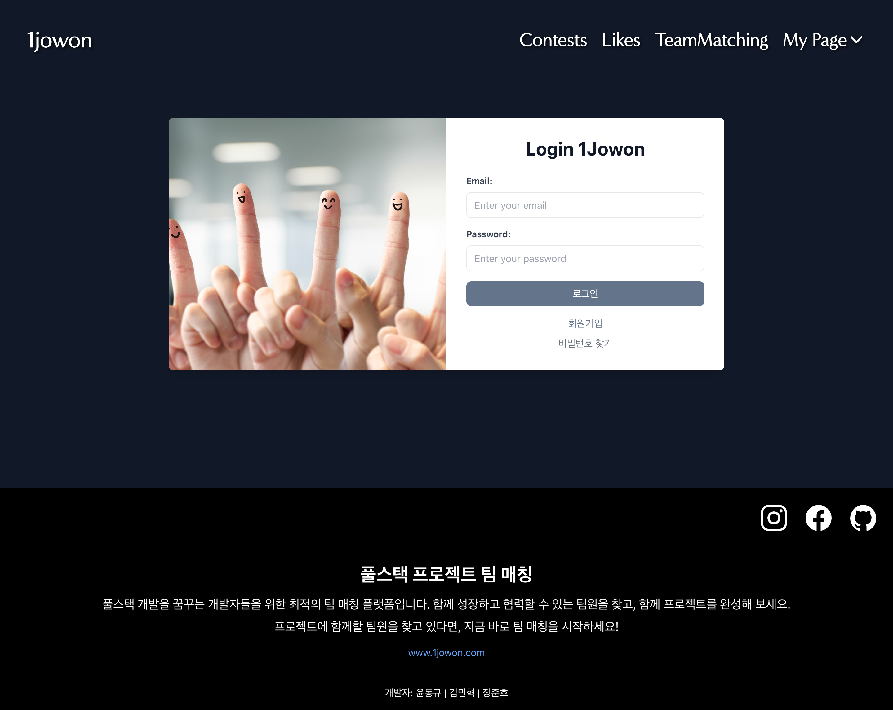
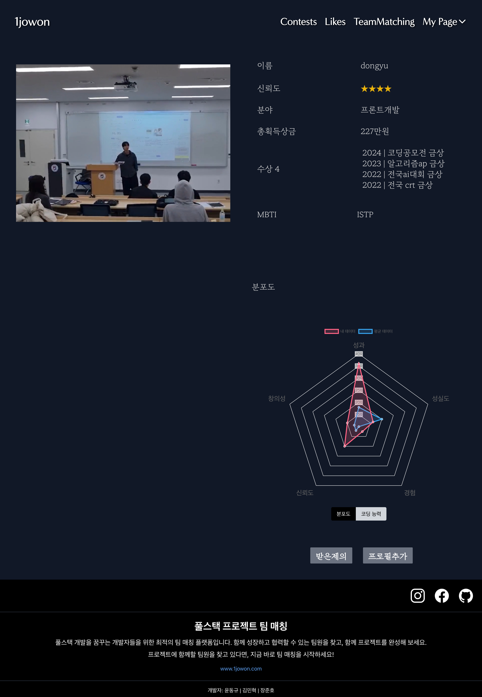

# 1Jowon: 대회 팀 매칭 플랫폼

**1Jowon**은 대회에 참여하고 싶은데 팀원이 부족하거나 혼자일 경우, 나에게 가장 적합한 팀원을 자동으로 매칭시켜주는 사이트입니다. 이 플랫폼을 통해, 개발자들이 손쉽게 팀원을 구하고 프로젝트를 완성할 수 있습니다.

---

## 주요 기능

- **대회 지원 및 팀 매칭**:
  사용자는 다양한 대회 정보를 확인하고, 원하는 대회에 지원할 수 있습니다. 만약 팀원이 부족하거나 혼자 지원할 경우, AI 기반 매칭 시스템이 나에게 가장 적합한 팀원을 찾아줍니다.

- **실시간 알림**:
  팀 매칭 및 대회 관련 업데이트를 실시간으로 받을 수 있습니다.

- **통계 및 그래프**:
  각 팀원들의 역량을 시각화하여 보다 효과적으로 팀을 구성할 수 있도록 도와줍니다.

---

## 수상 이력

이 프로젝트는 **AWS 전북 3개학교 연합 해커톤에서 대상을 수상**한 작품으로, **2024 겨울 AWS 해커톤 초청작**으로 선정되었습니다.

---

## 사용 기술

- **프론트엔드**: React, Context API
- **백엔드**: Django, DRF, AWS
- **인공지능**: AI 기반 팀원 매칭 알고리즘
- **배포**: AWS (Amazon Web Services)

---

## 스크린샷

### 메인 페이지:

### 대회 목록 페이지:

### 로그인 페이지:

### 프로필 페이지:

### 팀 매칭 페이지:

### 팀 매칭 확인 팝업:

---

## 사용 방법

1. 회원 가입 후 로그인.
2. 원하는 대회에 지원.
3. 팀원이 부족할 경우, AI 기반 팀 매칭 기능 사용.
4. 대회에 팀으로 참여하여 프로젝트 완성!

---
